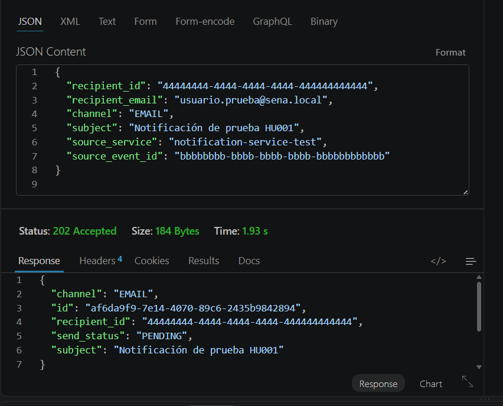
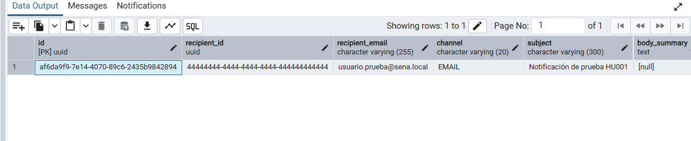
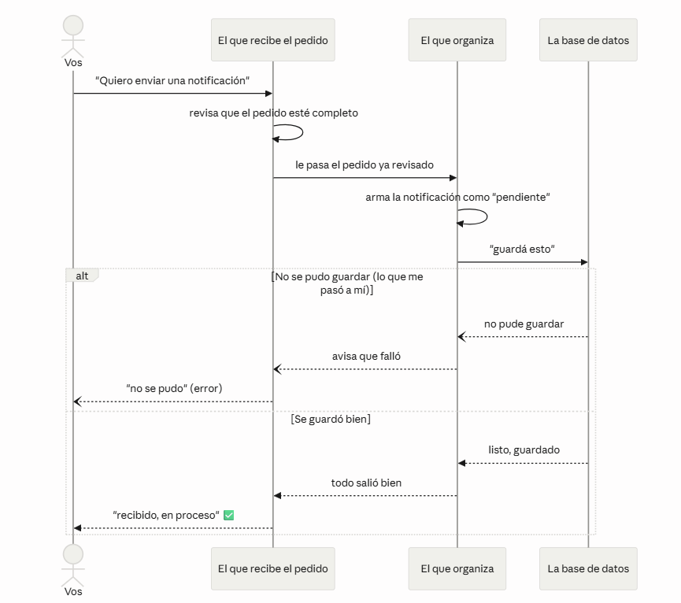

# HU001 — Enviar notificación vía API (contract-first, POST /notifications)

## 1. ¿Qué hace esta HU?

Permite que un servicio externo (o una persona) cree una notificación
llamando a `POST /notifications`. La API la guarda en estado `PENDING`
y responde `202 Accepted` — no la envía en el momento, queda lista
para que el `notification-worker` la procese después (patrón Outbox).

## 2. Cómo la entendí / cómo se aborda en el código

Lo entendí como una cadena de 3 personas que se van pasando el mismo
pedido, y cada una hace UNA sola cosa:

**1. El que recibe el pedido — `handler.go`**
Es el archivo que "escucha" internet. Cuando alguien manda un
`POST /notifications`, este archivo:
- Revisa que el pedido venga completo (por ejemplo, que no falte el
  destinatario o el mensaje).
- Revisa que el canal sea uno permitido (`EMAIL` o `IN_APP`, no
  cualquier cosa).
- Si todo está bien, lo traduce a un formato interno y se lo pasa al
  siguiente archivo.
- Al final, responde diciendo "recibido" (código `202`).

**2. El que organiza el trabajo — `send_notification.go`**
Recibe ese pedido ya traducido y decide qué hacer con él:
- Crea la notificación con estado `PENDING` (pendiente, todavía no
  se envió).
- Si el pedido dice que use una plantilla guardada, la busca y arma
  el mensaje con ella. Si no hay plantilla, usa el texto que ya
  venía en el pedido.
- Al final, la manda a guardar.

**3. Las reglas del negocio — `notification.go`**
Es el archivo que define qué es "una notificación válida": qué
canales existen (`EMAIL`, `IN_APP`) y qué estados puede tener
(`PENDING`, `SENT`, `FAILED`). No sabe nada de internet ni de bases
de datos — solo conoce las reglas.

**En resumen:** un archivo recibe el pedido, otro decide qué hacer
con él, y otro define las reglas que todo tiene que cumplir. Como
cada uno hace una sola cosa, es fácil de entender y se puede cambiar
una parte sin romper las otras.

## 3. Evidencia — comando ejecutado

```powershell
{
  "recipient_id": "44444444-4444-4444-4444-444444444444",
  "recipient_email": "usuario.prueba@sena.local",
  "channel": "EMAIL",
  "subject": "Notificación de prueba HU001",
  "source_service": "notification-service-test",
  "source_event_id": "bbbbbbbb-bbbb-bbbb-bbbb-bbbbbbbbbbbb"
}
```

**Respuesta obtenida:**


**Verificación en base de datos:**
```sql
select * from notification.sent_notification order by created_at desc limit 1;
```


## 4. Capturas / diagrama



## 5. Mejora propuesta

Ahora mismo, el archivo que recibe el pedido (`handler.go`) revisa a
mano, campo por campo, que el pedido esté completo y correcto (por
ejemplo, que no falte el canal o que tenga un valor válido). El
problema es que si mañana agregan un campo nuevo, alguien tiene que
acordarse de escribir esa revisión a mano otra vez.

**Mi propuesta:** que esas revisiones se hagan solas, usando el mismo
contrato que ya usan para generar el código (el archivo con la
definición de la API). Así, si el contrato dice que un campo es
obligatorio, el sistema lo revisa automáticamente, sin que nadie
tenga que escribir esa validación cada vez a mano. Esto reduce el
riesgo de que alguien se olvide de validar algo nuevo en el futuro.