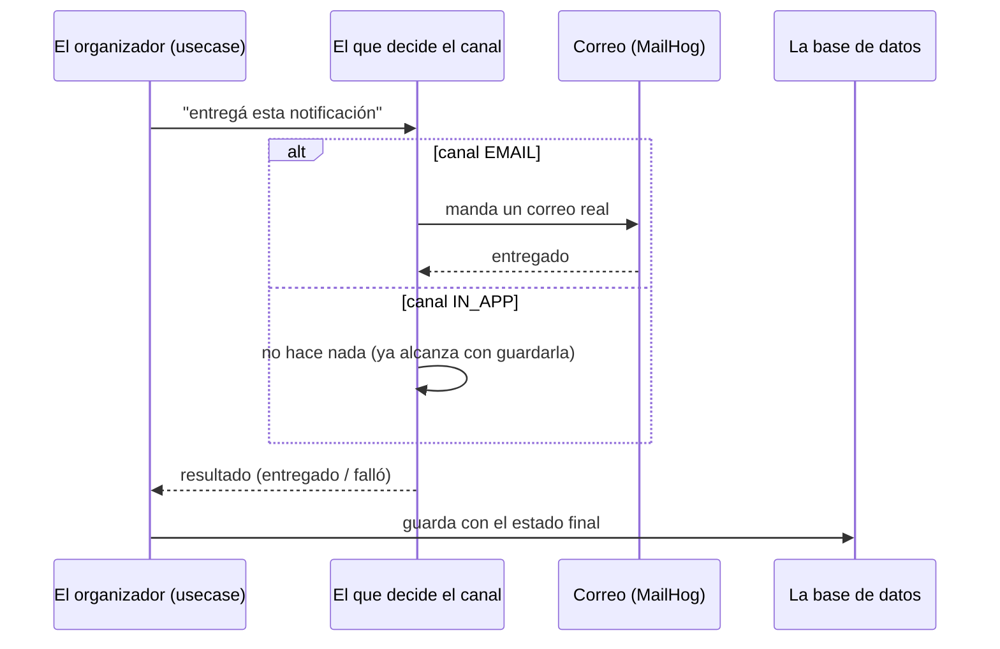
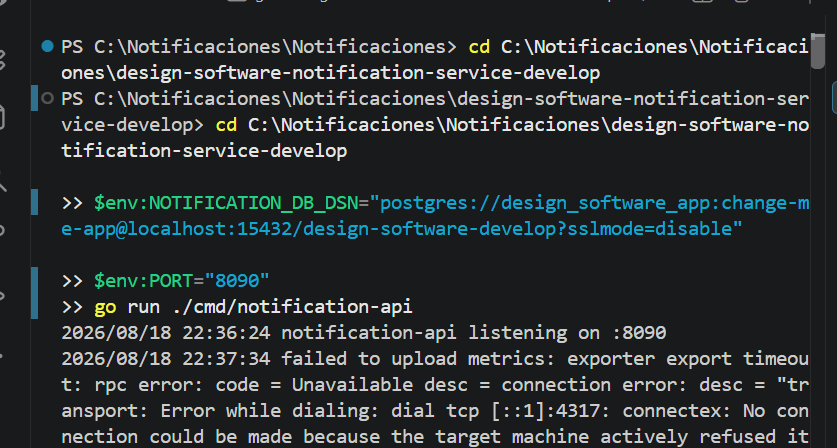
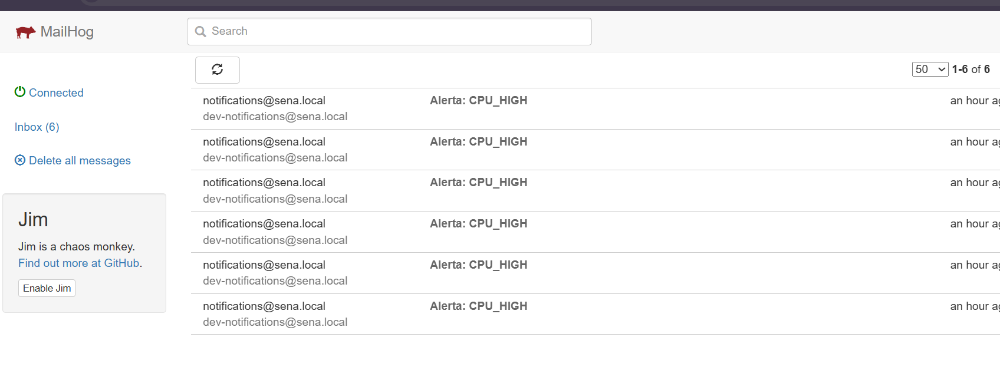
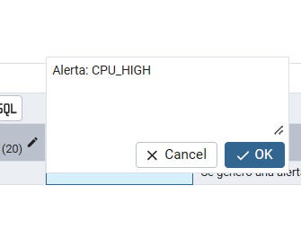
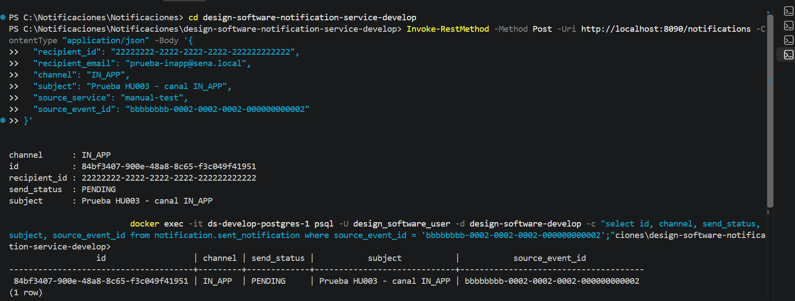
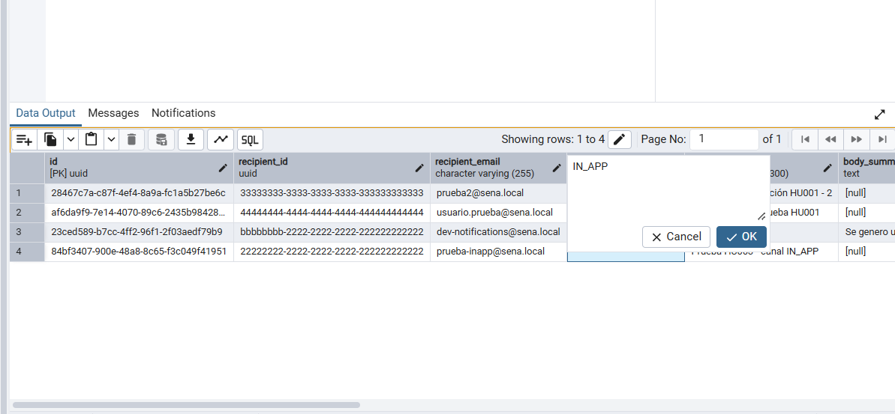

# HU003 — Entrega por canal EMAIL / IN_APP

## 1. ¿Qué hace esta HU?

Define **cómo se entrega** una notificación según el canal elegido:
por correo real (EMAIL, vía SMTP) o simplemente quedando disponible
para consulta (IN_APP, sin ninguna acción extra).

## 2. Cómo la entendí (en simple)

Pensé en dos formas de avisarle algo a alguien:

- **EMAIL = mandarle una carta a su casa.** Hay que escribirla y
  despacharla de verdad. Eso hace `smtp_notifier.go`: arma un correo
  y lo manda por SMTP. En mi entorno local no sale a internet — cae
  en **MailHog**, un buzón de pruebas donde puedo ver el correo
  "enviado" sin que le llegue a nadie real.

- **IN_APP = pegar un papelito en la cartelera de la oficina.** No
  hace falta entregarlo activamente — ya está ahí, visible, cuando
  la persona pase a mirar. Por eso `inapp_notifier.go` **no hace
  nada**: el método está vacío. La notificación "se entrega" con
  solo guardarse en la base — cuando alguien la consulte con
  `GET /notifications/{id}` (HU005), ahí la va a encontrar.

- **¿Quién decide cuál usar?** `composite_notifier.go` — es el que
  mira el canal pedido (`EMAIL` o `IN_APP`) y llama al que
  corresponde. Además, sea cual sea el resultado, anota si se
  entregó bien o mal, para las métricas (HU007).

## 3. Diagrama de secuencia (simple)



## 4. Evidencia — cómo lo probé


```json
{
  "event_id": "cccccccc-3333-3333-3333-333333333333",
  "event_type": "monitoring.alert.triggered",
  "source_service": "manual-test",
  "timestamp": "2026-08-18T22:00:00Z",
  "version": "1.0",
  "payload": {
    "affected_entity_type": "Ficha",
    "affected_entity_id": "bbbbbbbb-2222-2222-2222-222222222222",
    "alert_type_code": "CPU_HIGH"
  }
}
```
Entré a MailHog (`http://localhost:18025`) y confirmé que el
correo "Alerta: CPU_HIGH" llegó de verdad, entregado por
`smtp_notifier.go`.]





**b) Canal IN_APP (persistencia pasiva) — vía API:**
Con el `notification-api` corriendo (`go run ./cmd/notification-api`),
mandé:
```json
{
  "recipient_id": "22222222-2222-2222-2222-222222222222",
  "recipient_email": "prueba-inapp@sena.local",
  "channel": "IN_APP",
  "subject": "Prueba HU003 - canal IN_APP",
  "source_service": "manual-test",
  "source_event_id": "bbbbbbbb-0002-0002-0002-000000000002"
}
```


Como esperaba, en MailHog no apareció nada nuevo. A diferencia de
mi hipótesis inicial, el registro no queda como `SENT` sino como
`PENDING` — porque este endpoint nunca invoca al `Notifier`
(ni para EMAIL ni para IN_APP): solo guarda. La "entrega" IN_APP
real (sin acción, `inapp_notifier.go` vacío) solo se ejecutaría si
este evento pasara por el worker, pero hoy el worker tiene el canal
fijo en EMAIL (ver sección 7).

**Verificación en base de datos (ambos casos):**
```sql
select id, channel, send_status, subject, source_event_id
from notification.sent_notification
where source_event_id in
  ('cccccccc-3333-3333-3333-333333333333',
   'bbbbbbbb-0002-0002-0002-000000000002');
```
Resultado: la fila EMAIL con `send_status = SENT`, la fila IN_APP
con `send_status = PENDING`
.



## 5. Mejora propuesta

Hoy, el canal `IN_APP` "se entrega" con solo guardar el registro —
pero eso significa que la persona **solo se entera si va y pregunta**
(`GET /notifications/{id}` o listando sus notificaciones). Mi
propuesta: agregar un mecanismo de aviso en tiempo real para
`IN_APP` (por ejemplo, WebSockets o Server-Sent Events) para que la
notificación "empuje" un aviso a la app abierta del usuario en vez
de depender de que alguien la vaya a consultar por su cuenta.