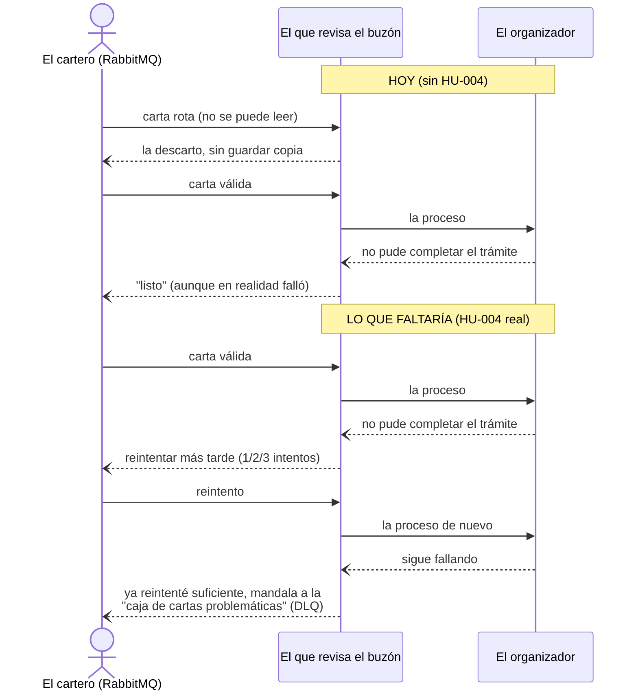
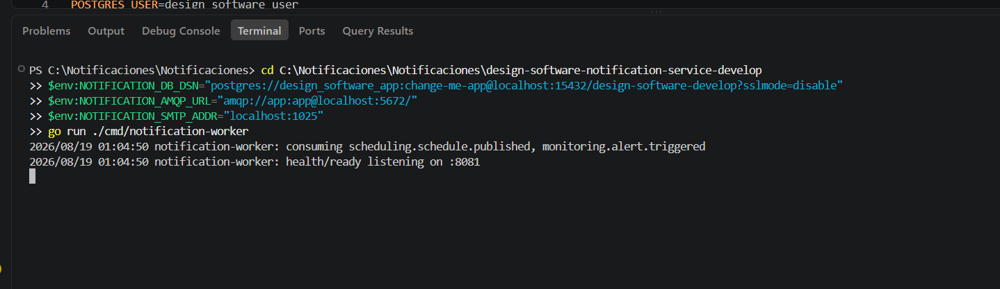
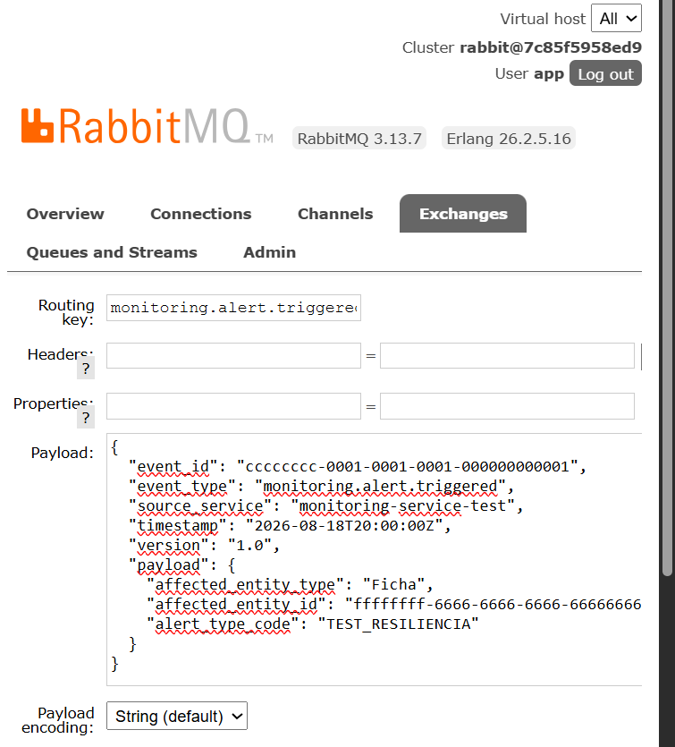
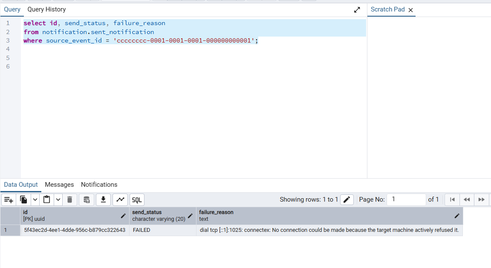

# HU004 — Resiliencia: reintentos, DLQ, idempotencia

**Aprendiz:** _(tu nombre / usuario de GitHub)_
**Ficha:** 3145555
**Repo:** design-software-notification-service (rama `develop`)

## 1. ¿Qué hace esta HU (y qué estado tiene hoy)?

De las 3 cosas que promete el título, hoy en el código:

- ✅ **Idempotencia:** implementada (viene de HU002, vía índice único
  en `source_event_id`).
- ❌ **Reintentos:** NO implementados.
- ❌ **DLQ (cola de mensajes fallidos):** NO implementada.

Esto no es un supuesto mío — está confirmado textual en el propio
`README.md` del repo:

> *"there is no DLQ yet (that's HU-NOTIF-004)"*
> *"Pending (out of this HU): ... retries/backoff/DLQ (HU-NOTIF-004) ..."*

Y en el comentario del código (`internal/adapter/in/amqp/consumer.go`,
línea 98-102) se documenta explícitamente que esta parte queda
pendiente.

## 2. Cómo lo entendí (en simple)

Con el cartero de HU002: hoy, si algo sale mal, pasan estas dos
cosas, y ambas terminan igual de mal — perdiendo el aviso:

- **Si la carta llega rota** (no se puede ni leer): se tira a la
  basura directo. No hay una "caja de cartas rotas" (DLQ) donde
  guardarla para revisarla después — se pierde para siempre.
- **Si la carta es válida pero el trámite falla** (ej: no se pudo
  mandar el correo, o la base estaba caída): el sistema **igual la
  marca como "ya procesada"** y sigue con la próxima. El intento
  fallido queda silenciado — nadie se entera, y no hay ningún
  reintento automático.

**Lo único que sí funciona bien hoy:** si la misma carta llega
duplicada (por ejemplo porque RabbitMQ reintenta la entrega a nivel
de red), el sistema no la procesa dos veces — eso es la idempotencia
que ya vimos en HU002, y sigue funcionando acá también.

## 3. Diagrama — comportamiento actual vs. lo que faltaría



## 4. Evidencia — cómo comprobé el vacío actual

Con el `notification-worker` corriendo, y **apagando MailHog a
propósito** (`docker stop <contenedor-mailhog>`) para forzar que el
envío del correo falle, mandé un evento válido (igual al de HU002):

```json
{
  "event_id": "cccccccc-0001-0001-0001-000000000001",
  "event_type": "monitoring.alert.triggered",
  "source_service": "monitoring-service-test",
  "timestamp": "2026-08-18T20:00:00Z",
  "version": "1.0",
  "payload": {
    "affected_entity_type": "Ficha",
    "affected_entity_id": "ffffffff-6666-6666-6666-666666666666",
    "alert_type_code": "TEST_RESILIENCIA"
  }
}
```



**Lo que confirmé:**
- El worker no reintentó el envío ni una sola vez.
- El evento no quedó en ninguna cola de "fallidos" — no existe.
- En la base, el registro quedó guardado con `send_status = FAILED`
  (eso sí funciona), pero **nadie vuelve a intentarlo automáticamente
  después**.

```sql
select id, send_status, failure_reason
from notification.sent_notification
where source_event_id = 'cccccccc-0001-0001-0001-000000000001';
```


## 5. Mejora propuesta (esta HU literalmente ES la mejora pendiente)

Implementar reintentos con backoff y una DLQ real, usando las
funciones nativas de RabbitMQ (sin reinventar nada a mano):

1. **Límite de intentos:** contar los reintentos (por ejemplo con un
   header `x-retry-count` en el mensaje) y, después de 3-5 intentos,
   dejar de reintentar.
2. **DLQ real:** cuando se agotan los reintentos, mandar el mensaje a
   una cola `notification-dlq` en vez de descartarlo — así alguien
   puede revisar manualmente qué eventos quedaron sin procesar y por
   qué, en vez de perderlos en silencio como pasa hoy.