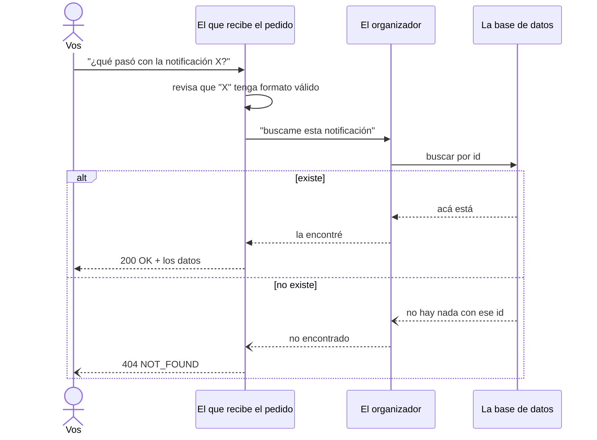
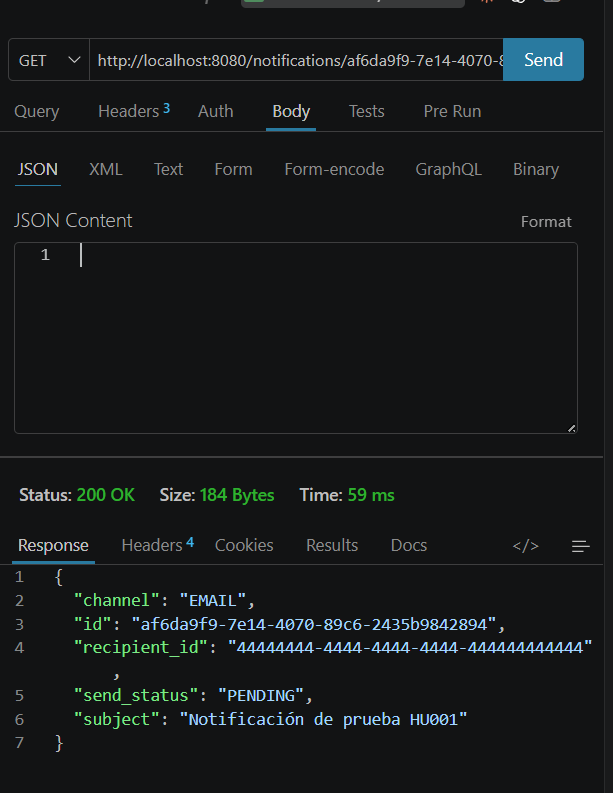
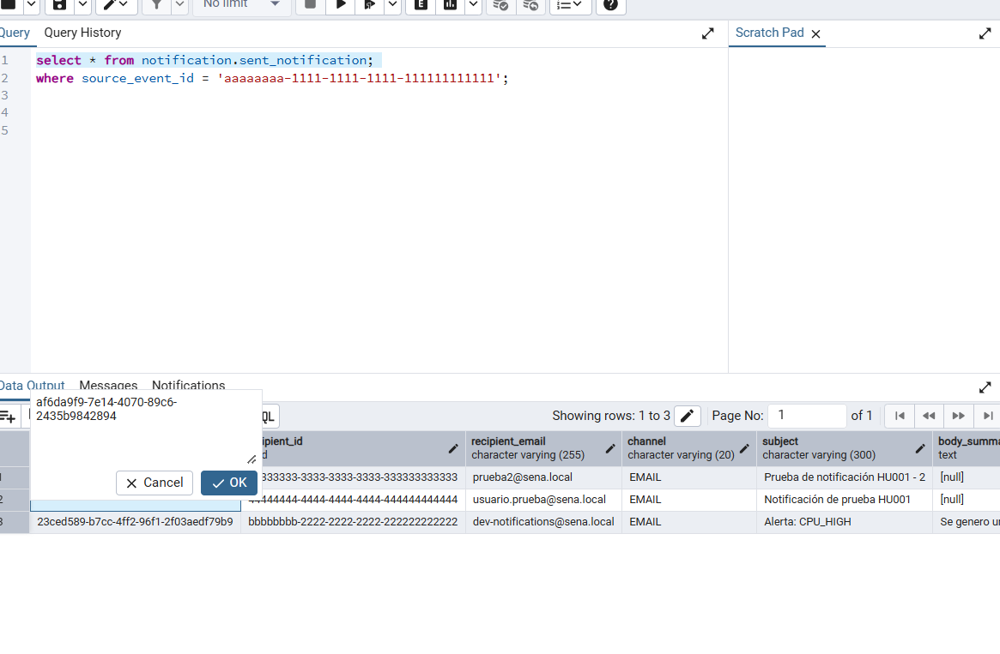
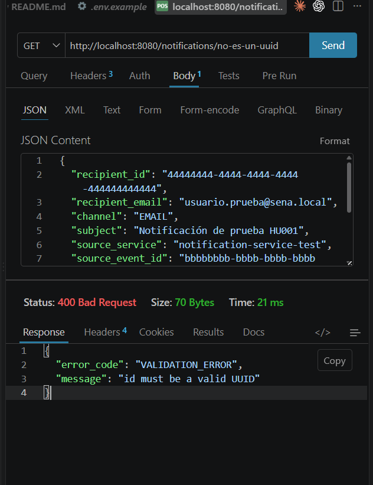

# HU005 — Consultar notificación enviada (GET)

## 1. ¿Qué hace esta HU?

Permite consultar el estado de una notificación ya creada, llamando
a `GET /notifications/{id}`. No crea ni modifica nada — solo busca y
devuelve lo que ya existe.

## 2. Cómo la entendí (en simple)

Es como preguntarle al mesero "¿qué pasó con mi pedido número tal?".
El mesero no cocina nada nuevo, solo va al pizarrón de pedidos, busca
el número, y te cuenta lo que dice ahí.

- **`handler.go` (`get`)**: recibe el `id` de la URL. Primero revisa
  que sea un UUID válido — si le mandás cualquier texto que no tenga
  ese formato, corta con `400` sin ni preguntarle a la base.
- **`get_notification.go` (usecase)**: literalmente le pide al
  repositorio "buscame este id". Si no existe, avisa "no
  encontrado". No decide nada más — a diferencia de HU001, acá no
  hay pasos que organizar, solo hay que ir a buscar el dato.

**La diferencia clave con HU001:** HU001 es un **comando** ("hacé
algo": crear, guardar, decidir). HU005 es una **consulta** ("decime
algo": buscar, mostrar). Por eso el código de HU005 es mucho más
corto — consultar no necesita orquestar nada.

## 3. Diagrama de secuencia (simple)



## 4. Evidencia — cómo lo probé

**a) Consultando una notificación que sí existe** (usando el `id`
que me devolvió HU001 al crearla):
```
GET http://localhost:8080/notifications/<id-real-de-HU001>
```
Resultado esperado: `200 OK` con todos los datos de la notificación.





**b) Consultando un id que no existe** (uno inventado pero con
formato UUID válido):
```
GET http://localhost:8080/notifications/00000000-0000-0000-0000-000000000000
```
Resultado esperado: `404 NOT_FOUND`.

**c) Consultando un id con formato inválido** (para probar la
validación antes de llegar a la base):
```
GET http://localhost:8080/notifications/no-es-un-uuid
```
Resultado esperado: `400 VALIDATION_ERROR` — sin llegar a
preguntarle nada a Postgres.



## 5. Mejora propuesta

Hoy solo se puede consultar **una** notificación a la vez, por su
`id` exacto. En la práctica, alguien probablemente va a querer ver
"todas mis notificaciones" o "las notificaciones de tal ficha", no
recordar un UUID puntual. Mi propuesta: agregar un endpoint de
listado, por ejemplo `GET /notifications?recipient_id=X`, con
paginación, para poder consultar por destinatario en vez de tener
que conocer el id exacto de antemano.