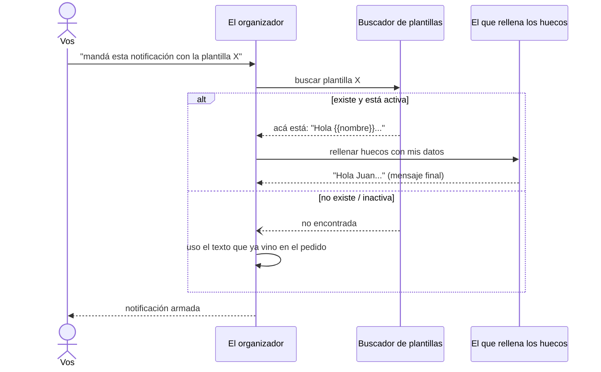
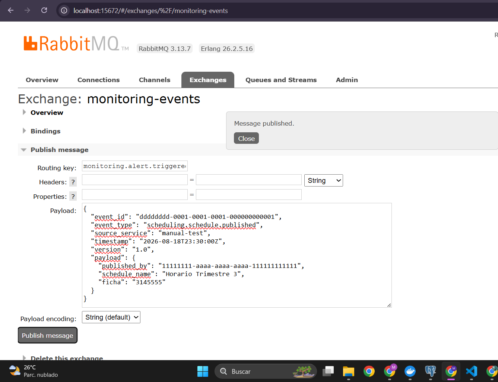
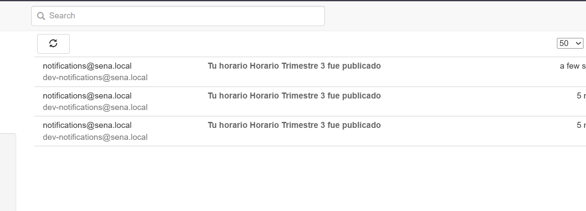
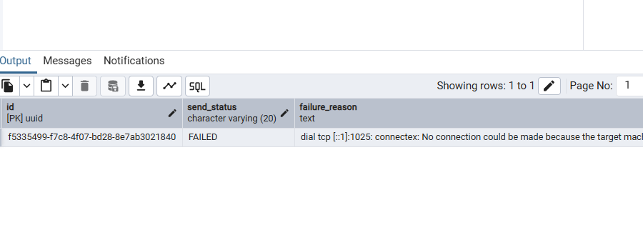

# HU006 — Plantillas de notificación


## 1. ¿Qué hace esta HU?

Permite armar el mensaje de una notificación a partir de una
**plantilla guardada de antes**, en vez de escribir el texto entero
cada vez. La plantilla tiene "huecos" (`{{clave}}`) que se rellenan
con datos reales al momento de enviar.

**Importante:** el microservicio **no crea plantillas por API** —
solo las lee. Las plantillas (`SCHEDULE_PUBLISHED`, `ALERT_TRIGGERED`)
ya vienen precargadas en la base de datos (sembradas por Liquibase,
no por un endpoint). La evidencia de esta HU es demostrar que el
sistema **usa** una plantilla existente, no crear una nueva.

## 2. Cómo la entendí (en simple)

Es como un mensaje de WhatsApp con variables: guardás de antes el
texto `"Hola {{nombre}}, tu pedido {{numero}} está listo"`, y cada
vez que lo usás, el sistema reemplaza `{{nombre}}` y `{{numero}}`
por los datos reales — no lo escribís de cero cada vez.

- **`template.go`** (domain): define qué es una plantilla — un
  código, un texto con huecos, y si está activa o no.
- **`template_renderer.go`** (domain): hace el reemplazo. Busca cada
  `{{clave}}` en el texto y la cambia por el valor real. Si falta
  una variable, la deja tal cual — no rompe nada.
- **`pg_template_repository.go`** (adapter out): busca la plantilla
  en la base por su código (solo lectura, `FindByCode`).
- **`send_notification.go`**: si el pedido trae un `template_code`,
  busca la plantilla y renderiza el mensaje; si no la encuentra o no
  vino ningún código, sigue con el `subject` que ya traía el pedido.

## 3. Diagrama de secuencia (simple)



## 4. Evidencia — cómo lo probé

**a) Con plantilla** (`SCHEDULE_PUBLISHED`, que espera las variables
`schedule_name` y `ficha` según el texto que vimos en la base):
```json
{
  "recipient_id": "22222222-2222-2222-2222-222222222222",
  "recipient_email": "prueba-plantilla@sena.local",
  "channel": "EMAIL",
  "template_code": "SCHEDULE_PUBLISHED",
  "template_vars": {
    "schedule_name": "Horario Trimestre 3",
    "ficha": "3145555"
  },
  "source_service": "manual-test",
  "source_event_id": "dddddddd-0001-0001-0001-000000000001"
}
```


Verifiqué en MailHog que el correo llega con el texto de la plantilla
ya armado: *"El horario Horario Trimestre 3 de la ficha 3145555 ha
sido publicado"* — sin que yo haya escrito ese texto en el pedido.

**b) Sin plantilla** (mismo pedido, pero con `subject` propio y sin
`template_code`), para mostrar el contraste — el correo llega con
exactamente el texto que mandé, sin ningún reemplazo.

**c) Con un código de plantilla inexistente** (`template_code:
"NO_EXISTE"`), para confirmar que el sistema no rompe — simplemente
sigue con el `subject` original del pedido.

**Verificación en base de datos:**
```sql
select subject, body_summary, template_id
from notification.sent_notification
where source_event_id = 'dddddddd-0001-0001-0001-000000000001';
```


## 5. Mejora propuesta

Hoy, si mandás un `template_code` pero **te olvidás una variable**
que la plantilla necesita, el sistema no avisa nada — simplemente
deja el `{{hueco}}` sin rellenar en el mensaje final, y el
destinatario recibe un correo con `{{schedule_name}}` literal escrito
ahí. Mi propuesta: que `Render()` devuelva también una lista de
variables que faltaron, para poder loguear un aviso (o incluso
rechazar el envío) en vez de mandar un mensaje roto sin que nadie se
entere.