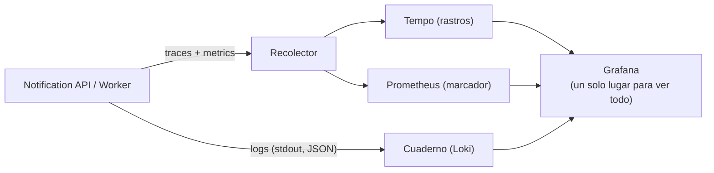
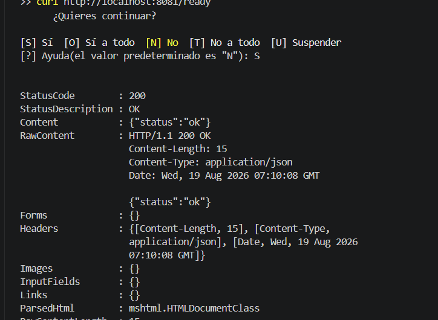
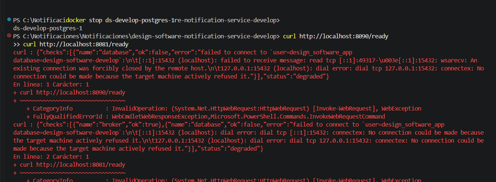
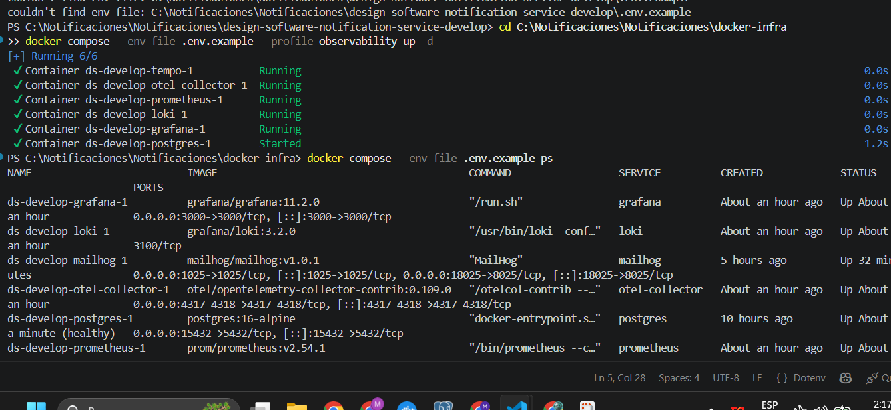

# HU007 — Observabilidad OpenTelemetry (traces/metrics/logs) + health

## 1. ¿Qué hace esta HU?

Le agrega al microservicio la capacidad de "verse a sí mismo desde
afuera": seguir el recorrido de un pedido puntual (traces), llevar un
marcador de números generales (metrics), escribir un cuaderno de
bitácora (logs), y responder si está vivo y en condiciones de
trabajar (health/ready).

## 2. Cómo la entendí (en simple)

Como las herramientas que tiene un restaurante para saber cómo va
todo sin preguntarle a cada mesero uno por uno:

- **Traces:** seguir un pedido puntual paso a paso, con hora exacta
  de cada etapa. El rastro no se corta aunque el pedido pase de una
  persona a otra en momentos distintos (por ejemplo, de la API al
  worker) — viaja pegado al pedido.
- **Metrics:** un marcador de todos los pedidos juntos — cuántos
  entraron, cuántos fallaron, cuánto tardó en promedio. Sirve para
  ver tendencias, no casos puntuales.
- **Logs:** el cuaderno de bitácora — cada anotación viene etiquetada
  con el número del pedido (`trace_id`), así se puede ir directo del
  rastro a las líneas exactas que hablan de él.
- **Health vs Ready** (dos preguntas distintas):
  - `/health` = "¿estás vivo?" — pulso básico.
  - `/ready` = "¿estás vivo Y en condiciones de trabajar?" — revisa
    si de verdad puede llegar a la base y al broker.

## 3. Dónde está cada cosa en el código

- `internal/platform/otel/otel.go`: prende traces y metrics, los
  conecta a un recolector externo.
- `internal/platform/otel/metrics.go`: define qué números se cuentan
  (requests HTTP, duración, notificaciones entregadas por
  canal/estado).
- `internal/platform/logging/logging.go`: define cómo se escribe cada
  anotación (JSON, con `trace_id` pegado si hay un rastro activo).
- `handler.go` → `health()` y `ready()`: las dos preguntas de arriba.

## 4. Diagrama (simple)



## 5. Evidencia — cómo lo probé

**a) Health / Ready:**
```powershell
curl http://localhost:8080/health
curl http://localhost:8080/ready
```


- Falla si apago el Postgres

Con todo levantado, ambos devuelven `200 OK`. Apagué Postgres a
propósito y volví a pedir `/ready` — pasó a devolver `503` con
`"status": "degraded"`, mostrando exactamente qué chequeo falló.

**b) Traces, metrics y logs (stack completo):**
```powershell
docker compose --env-file .env.example --profile observability up -d
```


Con eso levanté Grafana (`http://localhost:3000`, entra sin login),
Tempo, Prometheus y Loki. Corrí la API con las variables de entorno
apuntando al collector (`OTEL_EXPORTER_OTLP_ENDPOINT=localhost:4317`,
que ya es el default), mandé un par de `POST /notifications`, y en
Grafana:
- **Tempo:** busqué el trace del request y vi el recorrido completo.
- **Prometheus:** vi el contador `http.server.requests` subir con
  cada request.
- **Loki:** busqué por `trace_id` y encontré las líneas de log
  correspondientes a ese request puntual.


## 6. Mejora propuesta

Hoy, si el collector de OpenTelemetry no está disponible, el
servicio solo lo loguea cada minuto (`failed to upload metrics`) y
sigue funcionando — lo cual está bien para no depender de la
observabilidad para funcionar. Pero no hay **ninguna alerta** que
avise si eso pasa por mucho tiempo. Mi propuesta: agregar una regla
de alerta en Prometheus/Grafana que avise si el servicio deja de
reportar métricas por más de X minutos — así un problema de
observabilidad no queda invisible hasta que alguien lo nota "a mano".