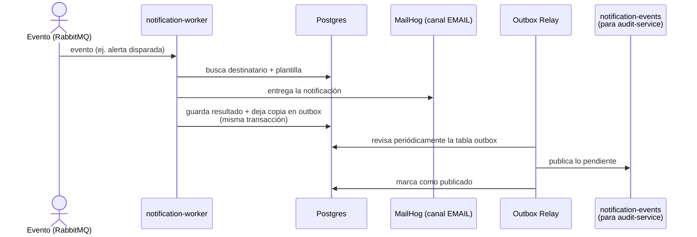
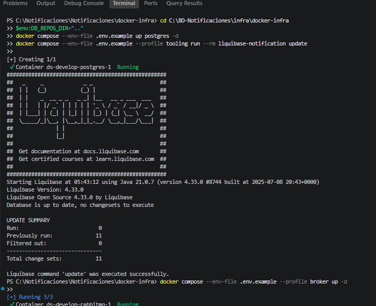
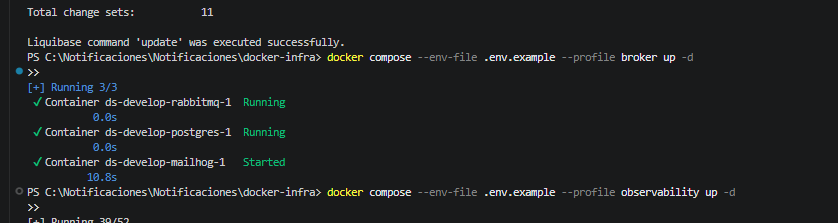

# HU008 — Levantado local end-to-end (docker-infra)


## 1. ¿Qué hace esta HU?

No es una pieza de código nueva — es la **demostración integradora**:
probar que todo el sistema (API + worker + Postgres + RabbitMQ +
MailHog + observabilidad) funciona junto, de punta a punta, en un
equipo local, sin depender de nada desplegado en la nube.

## 2. La pieza que faltaba: el Outbox Relay

Cuando el worker procesa un evento y lo entrega, además de guardarlo,
deja una copia en la tabla `notification.outbox` (en la misma
transacción, para no perderla). El `OutboxRelay` es un proceso que
revisa esa tabla cada tanto y publica esos eventos hacia afuera
(exchange `notification-events`), para que `audit-service` se entere
de que la notificación se envió. Es el mismo patrón Outbox que se ve
desde el primer vistazo a la base de datos, ahora con el código que
lo implementa.

## 3. El recorrido completo (todo junto)



## 4. Cómo lo probé — levantado completo

**Infra base (Postgres + schema):**
```powershell
cd C:\BD-Notificaciones\infra\docker-infra
$env:DB_REPOS_DIR=".."
docker compose --env-file .env.example up postgres -d
docker compose --env-file .env.example --profile tooling run --rm liquibase-notification update
```


**Broker + correo de pruebas:**
```powershell
docker compose --env-file .env.example --profile broker up -d
```



**La corrida end-to-end:**
1. `POST /notifications` vía Thunder Client → `202 Accepted` (HU001).
2. Publiqué un evento en RabbitMQ → el worker lo procesó (HU002).
3. Confirmé el correo en MailHog para canal EMAIL (HU003).
4. `GET /notifications/{id}` → devolvió el estado final (HU005).
5. Revisé en la base que `notification.outbox` tuvo su fila marcada
   `published_at` después de un rato (el relay la levantó y publicó).
6. Confirmé todo en Grafana: el trace completo, las métricas subiendo,
   y los logs con el mismo `trace_id` (HU007).


## 7. Mejora propuesta

Levantar todo esto hoy requiere **6 comandos manuales en orden
exacto**, en varias terminales distintas, y es fácil pisarse (como
me pasó con el `.env.develop` que no existía, o el `DB_REPOS_DIR` mal
apuntado). Mi propuesta: un solo script (`start-local.ps1` /
`Makefile`) que levante todo el stack en el orden correcto, con
chequeos de espera entre pasos (por ejemplo, no correr Liquibase
hasta que Postgres esté `healthy`), para que levantar el entorno
completo sea un solo comando en vez de una secuencia manual propensa
a errores.